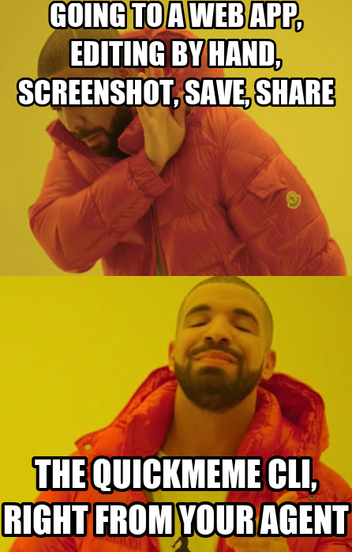

<p align="center">
  
</p>

<h1 align="center">quickmeme</h1>

<p align="center">
  React with a meme without leaving your terminal.<br>
  Your agent picks a template, fills in the text, and the PNG lands on your clipboard.
</p>

---

That meme up top was made with quickmeme:

```sh
quickmeme make drake "going to a web app, editing by hand, screenshot, save, share" "the quickmeme CLI, right from your agent"
```

## Install

```sh
uv tool install git+https://github.com/jrdn1891/quickmeme
```

## Use it

```sh
quickmeme search drake        # find a template and see its text boxes
quickmeme list                # all 209 templates
quickmeme make drake "left on unread" "left on read"
```

`make` renders the meme, copies the PNG to your clipboard, and opens it in Preview.
Text maps to the template's boxes in order — `search` tells you how many each one has.

It's built to be driven by a coding agent: `search` to discover, `make` to render.
No browser, no manual editing, no screenshot.

## How it works

- 209 templates (image + text-box geometry) vendored from [memegen](https://github.com/jacebrowning/memegen) (MIT).
- Rendering is fully local via Pillow: case styling, word-wrap, auto-fit, outline, and per-box rotation.
- Fonts: system Impact / Comic Sans, with bundled [Anton](https://fonts.google.com/specimen/Anton) (OFL) as the offline fallback.

Clipboard and Preview use macOS tools (`osascript` / `open`); the rendering itself runs anywhere.
